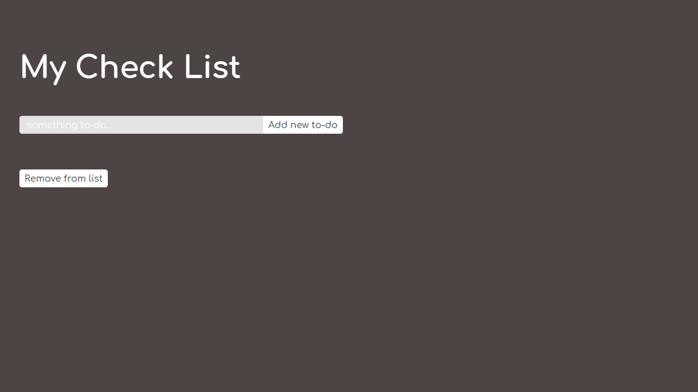
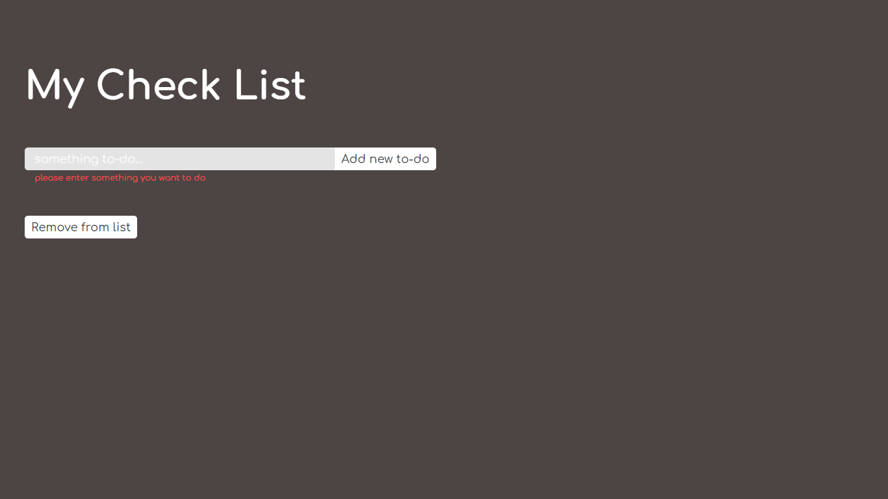
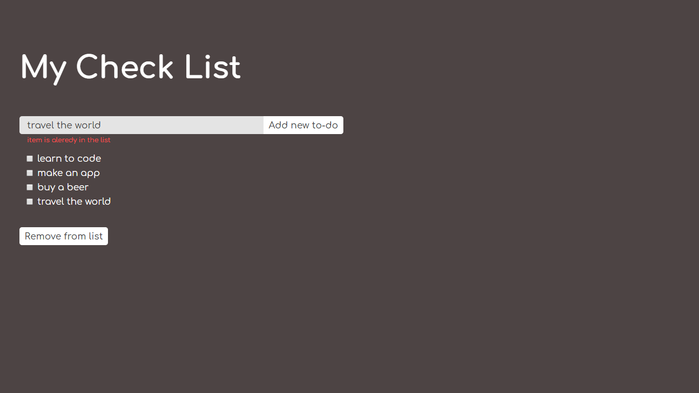

## To-Do-list (Front End Course - Coding Challenge)

Add or remove item from the list

### Task list:

```
• the 'add new to-do' button click should create a new <li> and inside it
  <input> type checkbox and <label> with the content from input field

• checking the checkbox should cross the <label> content (CSS solution)

• the 'remove from list' button should delete all checked items from the list

• it would be preferable to use the MVC pattern
```





